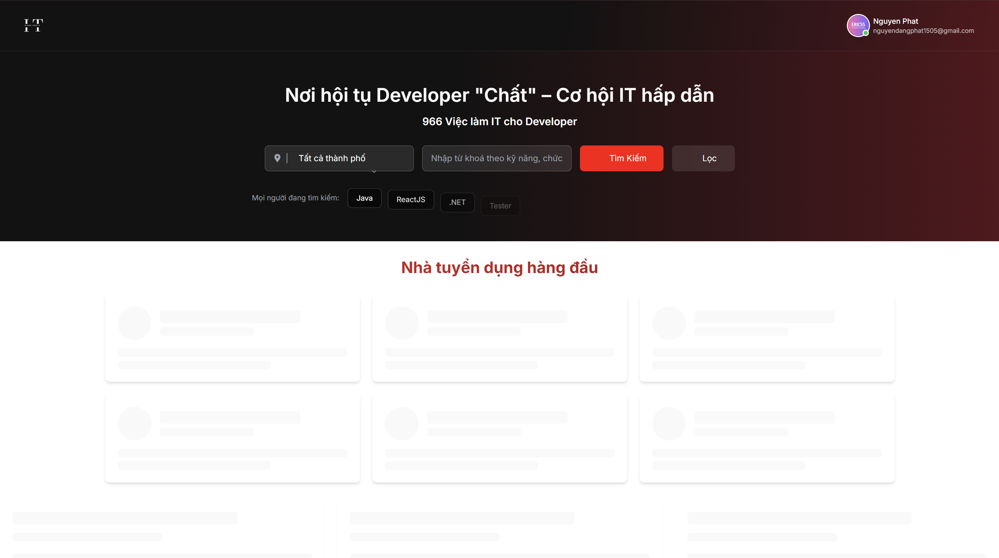

# 🎯 ViecLamHot - Job Recruitment Platform



## 📖 Giới thiệu

ViecLamHot là một nền tảng tuyển dụng việc làm được xây dựng với .NET 8 (Backend) và Next.js (Frontend). Hệ thống hỗ trợ việc tìm kiếm và quản lý công việc cho cả nhà tuyển dụng và người tìm việc.

## ✨ Tính năng chính

### 🏢 Dành cho Nhà tuyển dụng
- Đăng tin tuyển dụng
- Quản lý hồ sơ ứng viên
- Quản lý thông tin công ty
- Tìm kiếm và lọc ứng viên

### 👤 Dành cho Người tìm việc  
- Tìm kiếm việc làm
- Nộp hồ sơ ứng tuyển
- Quản lý CV/Resume
- Theo dõi trạng thái ứng tuyển

### ⚙️ Quản trị hệ thống
- Dashboard tổng quan
- Quản lý người dùng và phân quyền
- Quản lý nhà tuyển dụng
- Quản lý việc làm
- Activity logs
- Settings

## 🛠️ Công nghệ sử dụng

### Backend
- **.NET 8** - Web API
- **Entity Framework Core** - ORM
- **SQL Server** - Database
- **JWT Authentication** - Xác thực
- **BCrypt** - Mã hóa mật khẩu
- **MailKit** - Gửi email
- **Swagger** - API Documentation

### Frontend
- **Next.js 14** - React Framework
- **TypeScript** - Type Safety
- **Tailwind CSS** - Styling
- **Radix UI** - Component Library
- **Redux Toolkit** - State Management
- **React Hook Form** - Form Management

## 🚀 Cách chạy dự án

### Yêu cầu hệ thống
- **.NET 8 SDK**
- **Node.js** (v18+)
- **SQL Server** (Local hoặc Remote)
- **Git**

### 1️⃣ Clone repository
```bash
git clone https://github.com/nguyenphat006/ViecLamHot.git
cd ViecLamHot
```

### 2️⃣ Chạy Backend (.NET API)

```bash
# Di chuyển vào thư mục backend
cd backend/TuyenDungAPI

# Cài đặt dependencies
dotnet restore

# Cập nhật database (Migration)
dotnet ef database update

# Chạy API (sẽ chạy trên https://localhost:7041)
dotnet run
```

**API Documentation:** https://localhost:7041/swagger

### 3️⃣ Chạy Frontend (Next.js)

```bash
# Mở terminal mới, di chuyển vào thư mục frontend
cd frontend

# Cài đặt dependencies
npm install
# hoặc
yarn install

# Chạy development server (sẽ chạy trên http://localhost:9999)
npm run dev
# hoặc
yarn dev
```

## 🔧 Cấu hình

### Database Connection
Cập nhật connection string trong `backend/TuyenDungAPI/appsettings.json`:
```json
{
  "ConnectionStrings": {
    "DefaultConnection": "Server=YOUR_SERVER;Database=TuyenDungAPI;Trusted_Connection=true;TrustServerCertificate=true;"
  }
}
```

### Email Settings
Cấu hình SMTP trong `appsettings.json` để gửi email:
```json
{
  "SmtpSettings": {
    "Server": "smtp.gmail.com",
    "Port": 587,
    "SenderEmail": "your-email@gmail.com",
    "SenderPassword": "your-app-password"
  }
}
```

## 📁 Cấu trúc dự án

```
ViecLamHot/
├── backend/
│   └── TuyenDungAPI/
│       ├── Controllers/          # API Controllers
│       │   ├── Authentication/   # Auth endpoints
│       │   ├── Feature/         # Business logic endpoints
│       │   └── System/          # System management endpoints
│       ├── Database/            # DbContext
│       ├── Model/               # Entity models
│       ├── Service/             # Business services
│       └── Migrations/          # Database migrations
└── frontend/
    └── src/
        ├── app/                 # Next.js App Router
        ├── components/          # React components
        ├── services/            # API services
        ├── redux/               # State management
        └── types/               # TypeScript types
```

## 📞 Liên hệ

- **Author:** nguyenphat006
- **Repository:** [ViecLamHot](https://github.com/nguyenphat006/ViecLamHot)

---

⭐ Nếu dự án hữu ích, hãy cho một star nhé!
